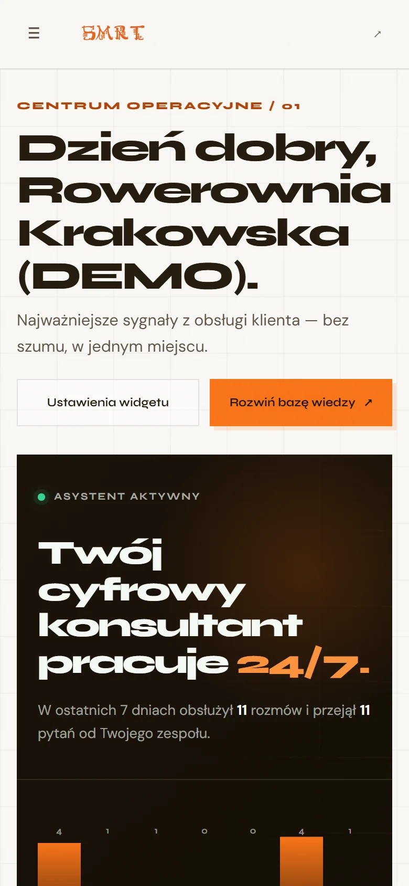
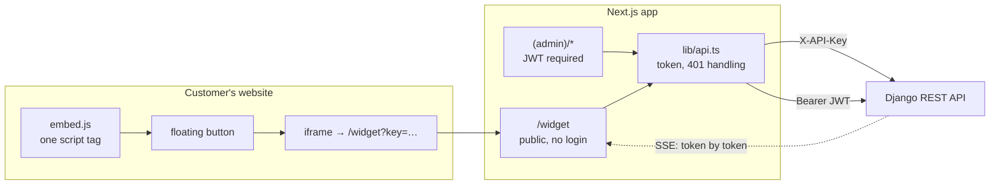

# SM-art Chat — panel and embeddable widget

Two products in one Next.js app: the chat window a visitor sees on a customer's website,
and the console the business owner uses to shape what it says.

[](https://github.com/piatekkrzysztof/frontend_chatbot/actions/workflows/ci.yml)


> **Language note.** This README is English; the UI, code comments and commit messages
> are Polish, because the product serves Polish small businesses.
>
> **Test badge is red on purpose.** There is no test suite yet. It is the first item on
> the roadmap, and pretending otherwise would be the wrong signal.

Backend (Django REST, RAG, billing) lives in
[`chatbot_project`](https://github.com/piatekkrzysztof/chatbot_project) — start there for
the system as a whole.

---

## What it does

**The widget** is what a visitor talks to. It loads inside an iframe on the customer's
own domain, streams answers token by token, and — when the bot has no grounded answer —
offers to take a contact detail instead of guessing.

**The panel** is where the owner decides what the bot knows: which pages and documents it
may quote, which of them to exclude from search, the FAQ, the greeting, the branding, the
retention period, and which questions it failed to answer last week.


<p>
  
  
</p>

<sub>Left: the widget at the size it actually renders in — 360×520, the frame
<code>embed.js</code> injects. Right: the panel on a phone.</sub>

---

## Live demo

| What | Where | Credentials |
|---|---|---|
| **Widget in the wild** | [agencjasm-art.pl](https://agencjasm-art.pl) — bubble, bottom right | none |
| **Panel** | [panel.agencjasm-art.pl](https://panel.agencjasm-art.pl) | `demo@agencjasm-art.pl` / `demo` |

The demo account is a `viewer`: every screen readable, nothing writable. Save buttons are
disabled in the UI *and* the API returns `403` — the second is what actually protects the
data; the first only stops you wasting a click.

---

## Architecture



The split matters for security: `/widget` must be embeddable from any origin — that is its
job — while the panel must not be embeddable from anywhere but its own domain, or a
logged-in owner could be clickjacked. `next.config.js` sets `frame-ancestors *` on the
first and `frame-ancestors 'self'` on everything else.

---

## Key technical decisions

**Streaming over `fetch` + `getReader()`, not `EventSource`.** Server-sent events are the
right transport, but `EventSource` can only issue a `GET` and cannot set headers — and
this request needs a `POST` body with the question plus an `X-API-Key`. So the widget
reads the response stream manually and parses `data:` lines itself.

**The refusal marker is stripped from the front of the stream.** The backend prefixes
unanswerable replies with a marker. It has to be at the *start*, because with streaming an
end-of-message marker arrives after the visitor has already read the answer. The widget
consumes the marker before painting the first token, so a refusal renders as a refusal
rather than as `[BRAK_ODPOWIEDZI] …`.

**The widget lives in an iframe, not injected into the host page.** Injecting a component
into a stranger's site means inheriting their CSS, their global styles and their bugs, and
exposing our DOM to their scripts. The iframe costs a little communication ceremony and
buys complete isolation in both directions.

**`embed.js` is plain, unbuilt JavaScript.** It is the one file the customer pastes into
their site. It has to run in whatever their site is — WordPress, Wix, a hand-written page
from 2014 — so it ships as ES5-ish script with no bundler, no framework, no dependencies.

**Two branding modes rather than a theme editor.** `smart` uses the fixed Sm-art palette;
`white_label` takes the customer's name, colour, logo, bot avatar and footer. A free-form
theme editor would let customers build unreadable colour combinations, and the contrast
work would then have to be redone per tenant.

**Touch targets are measured by probing, not by reading CSS.** `getBoundingClientRect()`
does not see a hit area extended with a pseudo-element, and an `<input>` wrapped in a
`<label>` has the label's target size, not its own. The audit that found 36 undersized
targets used `elementFromPoint` to find where a tap actually lands.

**Pointer-scope rules are disjoint.** Touch sizing lives in `@media (pointer: coarse)` and
the AA minimum in `@media (pointer: fine), (pointer: none)`. They were overlapping once,
and because a media query adds no specificity, the base rule beat the touch rule and the
mobile sizing silently did nothing.

---

## Quickstart

```bash
git clone https://github.com/piatekkrzysztof/frontend_chatbot.git
cd frontend_chatbot
npm install
echo "NEXT_PUBLIC_API_URL=http://localhost:8000/api" > .env.local
npm run dev
```

Open `http://localhost:3000`. You need the backend running on port 8000 — the fastest way
is `docker compose up -d` in
[`chatbot_project`](https://github.com/piatekkrzysztof/chatbot_project), then
`docker compose exec web python manage.py zasiej_demo` for a login and a widget key.

The widget alone, without logging in: `http://localhost:3000/widget?key=<widget key>`.

**If `npm run dev` reports `Cannot find module … [turbopack]_runtime.js`,** you ran
`npm run build` in the same tree; the two share `.next`. Fix: `rm -rf .next && npm run dev`.

---

## Commands

```bash
npm run dev        # dev server (Turbopack)
npm run build      # production build — 20 routes, 19 static
npm run lint       # ESLint
npx tsc --noEmit   # type check
npm run zrzuty     # regenerate README screenshots (needs --token, see script header)
```

### Current results

| | |
|---|---|
| Type check | clean |
| Build | passing — 20 routes, 19 prerendered, 1 dynamic |
| `npm audit` | **0 vulnerabilities** (was 7: 1 critical, 4 high, all in build tooling) |
| Unit tests | **none** |
| E2E tests | **none** — Playwright is installed and used only for screenshots so far |

Screenshots are generated by `scripts/zrzuty.mjs` against the seeded demo tenant, which
uses a fixed random seed. The images in this README and what you see after logging in to
the demo are therefore the same thing, not a staged mock-up.

---

## Security model

**The widget is public by design.** Its API key is visible in the page source — it has to
be, the browser sends it. The key is not a secret; it is an identifier. What protects it
is the backend's origin allowlist (`WidgetDomain`), which refuses a key used from a domain
the owner did not register, plus per-key and per-visitor rate limits.

**Framing policy differs per route,** as described above: `/widget` embeddable anywhere,
everything else same-origin only.

**Session handling.** Login stores a JWT and refresh token; every request carries
`Authorization: Bearer`. A `401` clears both tokens and performs a **full page load** to
`/login` rather than a client-side redirect — deliberately, so that no component keeps the
previous user's data in memory.

**Panel routes are guarded client-side** (`lib/withAuth.tsx`). This stops the wrong UI
rendering; it is not an authorisation boundary. Every panel endpoint is authorised
server-side, and the `viewer` role's read/write split is covered by backend tests.

**Known weakness — tokens in `localStorage`.** Any XSS in the panel can read them. This
was a deliberate simplification while every customer was onboarded by hand, and it is the
top security item on the roadmap: `HttpOnly` `Secure` `SameSite` refresh cookie, short
access token in memory, rotation and revocation, and a CSP as a second line of defence.

**Reporting a vulnerability:** krzysztof@agencjasm-art.pl, not a public issue.

---

## Known limitations

- **No tests.** Not thin coverage — none. Every change to session handling, SSE parsing,
  the Stripe return flow or a destructive action is currently verified by hand. This is
  the largest risk in the repository and the first thing being fixed.
- **JWT in `localStorage`**, with no refresh rotation or revocation (see above).
- **Route protection is client-side only.** Correct today because the API authorises every
  request, but it means a bug in the backend's permissions is not caught by a second layer.
- **No error boundary.** A render error in one panel screen blanks the page instead of
  degrading to a message.
- **No Content-Security-Policy beyond `frame-ancestors`.** No script-src, so the
  `localStorage` weakness has no second line of defence.
- **The panel is Polish-only.** No i18n layer; strings are inline.
- **The widget carries no offline or reconnect handling.** If the SSE stream drops
  mid-answer, the visitor sees a truncated reply and has to ask again.
- **Bundle size is not tracked.** The build passes, but no budget is enforced and no one
  would notice a regression.

---

## Roadmap

**Now — a test suite that protects money, data and access.** Not hundreds of tests;
15–25 covering the flows whose failure costs the user something: SSE parsing, login and
session expiry, widget embedding, the return from Stripe checkout, destructive actions,
and responsive behaviour of the main screens. Vitest and React Testing Library for
component logic, Playwright for the critical paths.

**Next — the auth rebuild.** `HttpOnly` refresh cookie, short-lived access token in
memory or a BFF layer in Next.js, rotation and revocation, CSP, and server-side route
protection.

**Then — polish that is currently unmeasured.** Error boundary, bundle budget in CI,
reconnect handling in the widget stream, and i18n if a non-Polish customer appears.

---

## Repository layout

```
app/(auth)/        login, registration, invitation acceptance
app/(admin)/       panel: dashboard, knowledge base, FAQ, bot test, widget settings,
                   conversations, leads, team, subscription, privacy, system health
app/widget/        the public chat window loaded in an iframe
components/widget/ WidgetChat (conversation), chrome (frame, header, footer), preview
lib/api.ts         fetch wrapper: token, 401 handling, error unwrapping
public/embed.js    the script the customer pastes into their site
scripts/zrzuty.mjs README screenshots (Playwright, system Chrome)
```

## Deployment (Vercel)

1. Import the repository; Next.js is detected automatically.
2. Set `NEXT_PUBLIC_API_URL` to the backend's `/api` URL.
3. Add the deployed domain to the backend's `DJANGO_CORS_ALLOWED_ORIGINS`, or the browser
   will block every widget request.

The embed snippet is generated in the panel from the address the panel is served on, so it
is correct straight after deployment without editing anything.

---

## Licence

**Source-available. All rights reserved.**

Copyright © 2026 Krzysztof Piątek (SM-art).

Published to be read and reviewed. Not licensed for reuse: no copying, modification,
distribution, self-hosting or operation, in whole or in part, without written permission.

Reading and discussing the code is welcome — krzysztof@agencjasm-art.pl.
